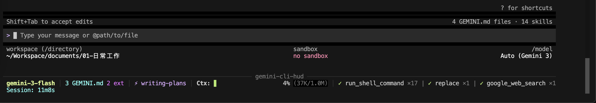

<div align="center">

# Gemini CLI HUD 💎

A real-time, bottom-sticky heads-up display (HUD) for [Gemini CLI](https://github.com/google/gemini-cli).

[](https://opensource.org/licenses/MIT)

*Read this in other languages: [English](README.md), [简体中文](README.zh-CN.md).*

</div>

---

**Gemini CLI HUD** is a real-time status monitor that renders a sticky status bar at the bottom of your terminal during Gemini CLI sessions. It provides critical observability into your AI agent's internal state — model, context usage, tool calls, and more — without interfering with your workflow.

## Screenshots




```
────────────────────────────────────── gemini-cli-hud ──────────────────────────────────────
 gemini-3-flash Pro xulei0331 │ git:(main) │ 4 GEMINI.md 2 ext │ Ctx: ██░░░░░░ 3% (28K/1.0M) 20 tok/s
 ↑84K ↓1K $0.013 │ Mem: 80% (19.1/24.0GB) │ Session: 5m3s
```

## Features

- **Bottom-Sticky HUD:** Renders at the terminal bottom using DECSTBM scroll regions, staying visible while you work.
- **Real-Time Context Usage:** Progress bar showing context window consumption percentage.
- **Token Throughput:** Displays tokens/sec rate (e.g., `1.2K tok/s`) next to the context bar.
- **Cost Estimation:** Real-time API cost tracking with input/output breakdown: `↑420K ↓52K $0.021`.
- **Subscription & Account Display:** Shows subscription tier (Pro/Free/Ultra) and account name next to the model, with OAuth/API fallback.
- **Active Model Tracking:** Displays the current model (e.g., `gemini-3-flash`).
- **Tool Observability:** Claude-HUD style tool display: `✓ Read ×8 | ✓ Bash ×4`.
- **GEMINI.md Counter:** Shows how many GEMINI.md files are loaded (project + global + extensions).
- **Extensions Counter:** Shows installed Gemini CLI extensions count.
- **Active Skill Tracking:** Displays the currently activated skill/extension.
- **Session Timer:** Elapsed time since session start.
- **Git Integration:** oh-my-zsh style branch display: `git:(main*)` with ahead/behind upstream counts.
- **System Memory Monitor:** Real-time memory usage (macOS `vm_stat` with cross-platform fallback).
- **Token Cache Breakdown:** Shows cached content tokens separately: `↑420K ↓52K ⚡20K $0.021`.
- **Multi-Session Support:** Each Gemini CLI instance gets its own isolated HUD daemon.
- **Session Cleanup:** Automatically resets terminal scroll region on session exit.
- **Configurable Layout:** Choose which modules to display, their order, and toggle individual elements via `~/.gemini/hud.json`.
- **Presets:** Three built-in presets — `full`, `essential`, `minimal` — for quick setup.
- **Responsive Layout:** Modules wrap to multiple lines on narrow terminals instead of truncating mid-text.
- **Title Bar Fallback:** Also sets the terminal title (OSC 0) as a secondary display.

## Installation

### Quick Install (from GitHub)

```bash
gemini extensions install https://github.com/yideng-xl/gemini-cli-hud
```

### Manual Install

1. **Clone and build:**
   ```bash
   git clone https://github.com/yideng-xl/gemini-cli-hud.git
   cd gemini-cli-hud
   pnpm install
   pnpm run build
   ```

2. **Install to Gemini extensions directory:**
   ```bash
   bash install.sh
   ```

3. **Restart Gemini CLI.** The HUD appears automatically.

## Configuration

Create `~/.gemini/hud.json` to customize the HUD. All fields are optional — missing fields use defaults. Changes take effect on the next hook event (no restart needed).

### Presets

Three built-in presets for quick setup:

| Preset | Modules | Description |
|--------|---------|-------------|
| `full` (default) | model, git, meta, skill, context, tools, cost, memory, session | Everything visible |
| `essential` | model, git, context, tools, session | Core info + git, no meta/skill/cost |
| `minimal` | model, context, session | Bare minimum |

```jsonc
{ "preset": "essential" }
```

### Recommended Configurations

**Full config with all options (default)** — save to `~/.gemini/hud.json`:

```json
{
  "preset": "full",
  "modules": ["model", "git", "meta", "skill", "context", "tools", "cost", "memory", "session"],
  "display": {
    "showModel": true,
    "showAuth": true,
    "showContext": true,
    "showTokenRate": true,
    "showTools": true,
    "showCost": true,
    "showSkill": true,
    "showSession": true,
    "showMeta": true,
    "showGit": true,
    "showMemory": true
  },
  "language": "en"
}
```

**Developer — focus on context & tools, skip cost:**

```jsonc
{
  "preset": "essential",
  "display": { "showTokenRate": true }
}
```

```
─── gemini-cli-hud ───
 gemini-3-flash Pro user │ git:(main) │ Ctx: ████░░ 42% (420K/1.0M) 1.2K tok/s
 ✓ Read ×8 | ✓ Bash ×4 │ Session: 12m
```

**Cost-conscious — track spending, hide meta:**

```jsonc
{
  "modules": ["model", "git", "context", "tools", "cost", "session"],
  "display": { "showMeta": false, "showSkill": false }
}
```

```
─── gemini-cli-hud ───
 gemini-3-flash Pro user │ git:(main) │ Ctx: ████░░ 42% (420K/1.0M)
 ✓ Read ×8 | ✓ Bash ×4 │ ↑420K ↓52K $0.021 │ Session: 12m
```

**Minimal — just model & context bar:**

```jsonc
{ "preset": "minimal" }
```

```
─── gemini-cli-hud ───
 gemini-3-flash Pro user │ Ctx: ████░░ 42% (420K/1.0M) │ Session: 12m
```

**Minimal + cost — compact but cost-aware:**

```jsonc
{
  "preset": "minimal",
  "display": { "showCost": true },
  "modules": ["model", "context", "cost", "session"]
}
```

```
─── gemini-cli-hud ───
 gemini-3-flash Pro user │ Ctx: ████░░ 42% (420K/1.0M) │ ↑420K ↓52K $0.021 │ Session: 12m
```

### Available Modules

| Module | What it shows |
|--------|---------------|
| `model` | Model name + subscription tier + account (e.g., `gemini-3-flash Pro xulei0331`) |
| `meta` | GEMINI.md file count + extensions count |
| `skill` | Currently active skill/extension |
| `context` | Context window progress bar + percentage + token rate |
| `tools` | Tool call counts: `✓ Read ×8 \| ✓ Bash ×4` |
| `cost` | Input/output tokens + estimated cost: `↑420K ↓52K $0.021` |
| `git` | Git branch in oh-my-zsh style: `git:(main*)` with `↑3 ↓1` |
| `memory` | System memory: `Mem: 80% (19.1/24.0GB)` |
| `session` | Elapsed time since session start |

### Display Flags

Fine-grained control over sub-elements within modules:

| Flag | Default | Controls |
|------|---------|----------|
| `showModel` | `true` | Model name display |
| `showAuth` | `true` | Subscription tier + account (falls back to OAuth/API) |
| `showContext` | `true` | Context progress bar |
| `showTokenRate` | `true` | Token throughput (tok/s) |
| `showTools` | `true` | Tool call statistics |
| `showCost` | `true` | Cost estimation |
| `showSkill` | `true` | Active skill name |
| `showSession` | `true` | Session timer |
| `showMeta` | `true` | GEMINI.md & extensions count |
| `showGit` | `true` | Git branch and status |
| `showMemory` | `true` | System memory usage |

### Language

| Value | Language |
|-------|----------|
| `"en"` | English (default) |
| `"zh"` | 简体中文 — `上下文:` `会话:` `词元/秒` `扩展` |

```json
{ "language": "zh" }
```

## Architecture

```
┌─────────────────────────────────────────┐
│ Gemini CLI (Ink rendering)              │  Scroll region: rows 1 to N-K
│ > your input                            │
│                                         │
├──────────── gemini-cli-hud ─────────────┤  Row N-K+1: separator
│ model │ meta │ Ctx: ██░░ │ tools │ time │  Row N-K+2..N: content
└─────────────────────────────────────────┘
```

- **Daemon** (`daemon.js`): Background process that maintains HUD state (model, tokens, tools, skill). Receives events via Unix socket. **Never writes to the terminal.**
- **Hook** (`hook.js`): Invoked synchronously by Gemini CLI on each event (SessionStart, AfterModel, AfterTool). Forwards events to daemon, receives rendered HUD content, and writes to `/dev/tty` using DECSTBM. **Only the hook touches the terminal** — this avoids race conditions with Ink.

## How It Works

| Event | What Happens |
|---|---|
| `SessionStart` | Hook starts daemon (if needed), resets state |
| `AfterModel` | Captures model name, prompt token count, context size, calculates token rate and cost |
| `AfterTool` | Tracks tool usage counts, detects `activate_skill` events |
| `SessionEnd` | Resets DECSTBM scroll region, cleans up socket file |

The hook renders the HUD synchronously during each event — no background timers, no polling, no race conditions with Gemini CLI's Ink engine.

## Known Limitations

- **Terminal resize:** HUD updates on the next hook event after resize (not instantly), to avoid race conditions with Ink.
- **Ink overwrites:** If Gemini CLI clears the screen (`\x1b[J`), the HUD may briefly disappear until the next event redraws it.
- **Cost estimation:** Based on published Gemini API pricing; actual billing may vary. Free-tier users are not charged.

## Roadmap

1. **Native Statusline API:** If Google exposes a UI injection API for extensions, migrate to it for perfect integration.
2. **Todo/Task Progress:** Display task completion status — pending upstream hook event support.
3. **Zero Dependency Migration:** Remove React/Ink runtime dependency for lighter installation.

## Inspiration

This project is inspired by [Claude HUD](https://github.com/jarrodwatts/claude-hud) by [Jarrod Watts](https://github.com/jarrodwatts). We wanted to bring the same level of observability to the Gemini CLI ecosystem.

## Contributors

- **[yideng-xl](https://github.com/yideng-xl)** — Creator and maintainer
- **Gemini** (Gemini 3 Flash / Pro) — AI pair programmer & co-architect. Built the initial daemon + hook architecture, title-bar prototype, and early DECSTBM explorations.
- **Claude** (Claude Opus 4.6) — AI pair programmer & co-architect. Implemented bottom-sticky DECSTBM rendering, responsive module layout, context tracking, tool display, GEMINI.md counting, skill tracking, and resize handling.

## License

MIT
