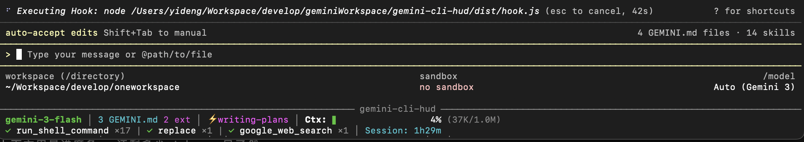

<div align="center">

# Gemini CLI HUD 💎

为 [Gemini CLI](https://github.com/google/gemini-cli) 打造的实时底部常驻状态栏 (HUD)。

[](https://opensource.org/licenses/MIT)

*其他语言版本: [English](README.md), [简体中文](README.zh-CN.md).*

</div>

---

**Gemini CLI HUD** 是一个在 Gemini CLI 会话期间，于终端底部渲染常驻状态栏的实时监控工具。它为你提供 AI 代理内部状态的关键观测信息 — 模型、上下文用量、工具调用等 — 且不干扰你的正常工作流。

## 效果预览




```
─────────────────────────────────── gemini-cli-hud ───────────────────────────────────
 gemini-3-flash OAuth │ 4 GEMINI.md 2 ext │ ⚡brainstorm │ Ctx: ████████░░░░ 42% (420K/1.0M) 1.2K tok/s
 main* ↑2 │ ✓ Read ×8 | ✓ Bash ×4 │ ↑420K ↓52K ⚡20K $0.021 │ Mem: 77% │ Pro xulei │ Session: 12m
```

## 核心特性

- **底部常驻 HUD：** 通过 DECSTBM 滚动区域渲染在终端底部，工作时始终可见。
- **实时上下文用量：** 进度条显示 Context Window 消耗百分比。
- **Token 吞吐速率：** 显示每秒 token 处理速率（如 `1.2K tok/s`）。
- **费用估算：** 实时 API 费用追踪，分别显示输入/输出 token：`↑420K ↓52K $0.021`。
- **认证方式显示：** 在模型名旁显示 `OAuth` 或 `API`。
- **活动模型追踪：** 显示当前模型（如 `gemini-3-flash`）。
- **工具观测：** Claude-HUD 风格的工具展示：`✓ Read ×8 | ✓ Bash ×4`。
- **GEMINI.md 计数：** 显示已加载的 GEMINI.md 文件数（项目 + 全局 + 扩展）。
- **扩展计数：** 显示已安装的 Gemini CLI 扩展数量。
- **活跃 Skill 追踪：** 显示当前激活的 skill/extension。
- **会话计时：** 从会话开始的已用时间。
- **Git 集成：** 显示当前分支、未提交更改标记、以及与上游的领先/落后提交数。
- **系统内存监控：** 实时内存使用情况（macOS `vm_stat` + 跨平台回退）。
- **Token 缓存明细：** 单独显示缓存内容 token：`↑420K ↓52K ⚡20K $0.021`。
- **账号与配额显示：** 通过 Google API 显示订阅等级和当前账号。
- **多会话支持：** 每个 Gemini CLI 实例拥有独立的 HUD daemon，互不干扰。
- **会话退出清理：** 退出时自动重置终端滚动区域，无需手动 `reset`。
- **可配置布局：** 通过 `~/.gemini/hud.json` 选择显示哪些模块、调整顺序、开关单个元素。
- **内置预设：** 三种预设 — `full`、`essential`、`minimal` — 快速切换。
- **响应式布局：** 窄终端时模块整体换行，不会在模块中间截断。
- **标题栏回退：** 同时设置终端标题 (OSC 0) 作为辅助显示。

## 安装方法

### 快速安装（从 GitHub）

```bash
gemini extensions install https://github.com/yideng-xl/gemini-cli-hud
```

### 手动安装

1. **克隆并构建：**
   ```bash
   git clone https://github.com/yideng-xl/gemini-cli-hud.git
   cd gemini-cli-hud
   pnpm install
   pnpm run build
   ```

2. **安装到 Gemini 扩展目录：**
   ```bash
   bash install.sh
   ```

3. **重启 Gemini CLI。** HUD 会自动出现。

## 配置

创建 `~/.gemini/hud.json` 来自定义 HUD。所有字段均为可选 — 缺省使用默认值。修改后无需重启，下次 hook 事件触发时即刻生效。

### 预设

三种内置预设，快速切换：

| 预设 | 包含模块 | 说明 |
|------|---------|------|
| `full`（默认） | model, meta, skill, context, git, tools, cost, memory, quota, session | 全部可见 |
| `essential` | model, context, git, tools, session | 核心信息 + git，隐藏 meta/skill/cost |
| `minimal` | model, context, session | 最精简 |

```jsonc
{ "preset": "essential" }
```

### 推荐配置

**完整配置（默认值）** — 保存到 `~/.gemini/hud.json`：

```json
{
  "preset": "full",
  "modules": ["model", "meta", "skill", "context", "git", "tools", "cost", "memory", "quota", "session"],
  "display": {
    "showModel": true,
    "showAuth": true,
    "showContext": true,
    "showTokenRate": true,
    "showTools": true,
    "showCost": true,
    "showSkill": true,
    "showSession": true,
    "showMeta": true,
    "showGit": true,
    "showMemory": true,
    "showQuota": true
  },
  "language": "en"
}
```

**开发者模式 — 关注上下文和工具，不看费用：**

```jsonc
{
  "preset": "essential",
  "display": { "showTokenRate": true }
}
```

```
─── gemini-cli-hud ───
 gemini-3-flash OAuth │ Ctx: ████░░ 42% (420K/1.0M) 1.2K tok/s
 ✓ Read ×8 | ✓ Bash ×4 │ Session: 12m
```

**费用敏感型 — 追踪开销，隐藏 meta：**

```jsonc
{
  "modules": ["model", "context", "tools", "cost", "session"],
  "display": { "showMeta": false, "showSkill": false }
}
```

```
─── gemini-cli-hud ───
 gemini-3-flash OAuth │ Ctx: ████░░ 42% (420K/1.0M)
 ✓ Read ×8 | ✓ Bash ×4 │ ↑420K ↓52K $0.021 │ Session: 12m
```

**极简模式 — 只看模型和上下文：**

```jsonc
{ "preset": "minimal" }
```

```
─── gemini-cli-hud ───
 gemini-3-flash │ Ctx: ████░░ 42% (420K/1.0M) │ Session: 12m
```

**极简 + 费用 — 精简但关注成本：**

```jsonc
{
  "preset": "minimal",
  "display": { "showCost": true },
  "modules": ["model", "context", "cost", "session"]
}
```

```
─── gemini-cli-hud ───
 gemini-3-flash │ Ctx: ████░░ 42% (420K/1.0M) │ ↑420K ↓52K $0.021 │ Session: 12m
```

### 可用模块

| 模块 | 显示内容 |
|------|---------|
| `model` | 模型名称 + 认证方式（OAuth/API） |
| `meta` | GEMINI.md 文件数 + 扩展数 |
| `skill` | 当前激活的 skill/扩展 |
| `context` | 上下文窗口进度条 + 百分比 + token 速率 |
| `tools` | 工具调用计数：`✓ Read ×8 \| ✓ Bash ×4` |
| `cost` | 输入/输出 token 数 + 预估费用：`↑420K ↓52K $0.021` |
| `git` | Git 分支、未提交状态、领先/落后：`main* ↑3 ↓1` |
| `memory` | 系统内存：`Mem: 77% (12.3/16.0GB)` |
| `quota` | 订阅等级 + 账号：`Pro xulei0331` |
| `session` | 会话已用时间 |

### 显示开关

模块内子元素的精细控制：

| 开关 | 默认值 | 控制内容 |
|------|--------|---------|
| `showModel` | `true` | 模型名称 |
| `showAuth` | `true` | 模型旁的 OAuth/API 标识 |
| `showContext` | `true` | 上下文进度条 |
| `showTokenRate` | `true` | Token 吞吐速率 (tok/s) |
| `showTools` | `true` | 工具调用统计 |
| `showCost` | `true` | 费用估算 |
| `showSkill` | `true` | 活跃 skill 名称 |
| `showSession` | `true` | 会话计时器 |
| `showMeta` | `true` | GEMINI.md 和扩展计数 |
| `showGit` | `true` | Git 分支和状态 |
| `showMemory` | `true` | 系统内存使用 |
| `showQuota` | `true` | 账号等级与配额信息 |

### 语言

| 值 | 语言 |
|----|------|
| `"en"` | English（默认） |
| `"zh"` | 简体中文 — `上下文:` `会话:` `词元/秒` `扩展` |

```json
{ "language": "zh" }
```

## 架构

```
┌──────────────────────────────────────────┐
│ Gemini CLI (Ink render area)             │  scroll region: row 1..N-K
│ > input                                  │
│                                          │
├─────────── gemini-cli-hud ───────────────┤  row N-K+1: separator
│ model │ meta │ Ctx: ██░░ │ tools │ time  │  row N-K+2..N: content
└──────────────────────────────────────────┘
```

- **Daemon** (`daemon.js`)：后台进程，维护 HUD 状态（模型、token、工具、skill）。通过 Unix socket 接收事件。**不写入终端。**
- **Hook** (`hook.js`)：由 Gemini CLI 在每个事件（SessionStart、AfterModel、AfterTool）时同步调用。将事件转发给 daemon，接收渲染好的 HUD 内容，通过 DECSTBM 写入 `/dev/tty`。**只有 hook 操作终端** — 避免与 Ink 产生竞争条件。

## 工作原理

| 事件 | 处理 |
|---|---|
| `SessionStart` | Hook 启动 daemon（如需要），重置状态 |
| `AfterModel` | 捕获模型名称、prompt token 数、上下文大小，计算 token 速率和费用 |
| `AfterTool` | 追踪工具调用次数，检测 `activate_skill` 事件 |
| `SessionEnd` | 重置 DECSTBM 滚动区域，清理 socket 文件 |

Hook 在每个事件期间同步渲染 HUD — 无后台定时器、无轮询、不与 Gemini CLI 的 Ink 引擎产生竞争。

## 已知限制

- **终端缩放：** 缩放后 HUD 在下一次 hook 事件时更新（非即时），以避免与 Ink 的竞争条件。
- **Ink 覆盖：** 如果 Gemini CLI 清屏（`\x1b[J`），HUD 可能短暂消失，直到下次事件重绘。
- **费用估算：** 基于 Gemini API 公开定价计算，实际账单可能有差异。免费用户不会产生费用。

## 后续计划

1. **原生 Statusline API：** 如果 Google 开放扩展 UI 注入 API，迁移到原生方案以实现完美集成。
2. **Todo/任务进度：** 显示任务完成状态 — 等待上游 hook 事件支持。
3. **零依赖迁移：** 移除 React/Ink 运行时依赖，实现更轻量的安装。

## 灵感来源

本项目的灵感来自 [Jarrod Watts](https://github.com/jarrodwatts) 为 Anthropic Claude Code 制作的 [Claude HUD](https://github.com/jarrodwatts/claude-hud)。我们希望在 Gemini CLI 生态中也能拥有同样的可观测性体验。

## 贡献者

- **[yideng-xl](https://github.com/yideng-xl)** — 创建者与维护者
- **Gemini** (Gemini 3 Flash / Pro) — AI 结对编程伙伴 & 联合架构师。构建了初始的 daemon + hook 架构、标题栏原型方案以及早期 DECSTBM 探索。
- **Claude** (Claude Opus 4.6) — AI 结对编程伙伴 & 联合架构师。实现了底部常驻 DECSTBM 渲染、响应式模块布局、上下文追踪、工具展示、GEMINI.md 计数、skill 追踪及窗口缩放处理。

## 许可证

MIT
